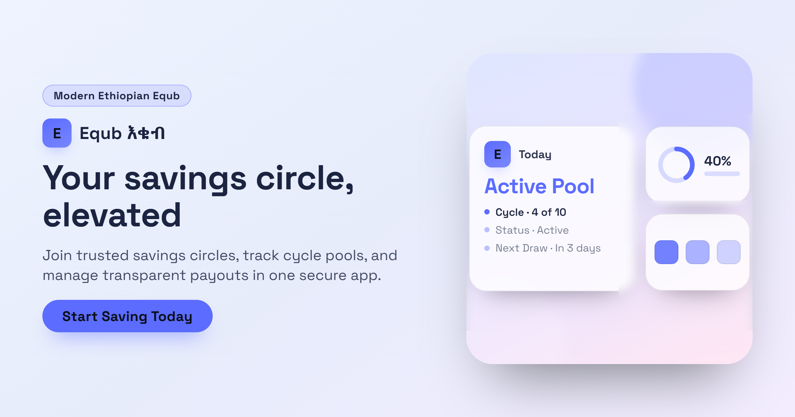

# Equb (እቁብ) — Modern Rotating Savings & Credit Platform



A modern, production-ready web application for managing Ethiopian Equb (እቁብ) rotating savings and credit associations (ROSCA). Built with Next.js 15, TypeScript, Tailwind CSS, and Firebase.

---

## Features

- **Traditional Equb, Modernized**: Digitizes the traditional Ethiopian peer-to-peer rotating savings model with transparent ledgers, automated cycle schedules, and zero administrative fees.
- **Chapa Payment & Payout Integration**:
  - In-app mobile money contributions via Telebirr, CBE Birr, Ebirr, and M-Pesa.
  - Official Chapa Hosted Checkout redirect for comprehensive test banking & OTP simulation.
  - Spacious payment modal that opens Chapa's hosted checkout automatically and verifies payments after return.
  - Automated return verification page (`/payments/chapa/complete`) with polling settlement support.
  - Outbound winning disbursements directly to winners' Ethiopian bank accounts via Chapa Transfers API.
- **Account & Payout Settings (`/settings`)**:
  - Manage identity, contact phone number, and winning payout bank/wallet details.
  - Dynamic bank list backed by `/api/banks` (CBE, Telebirr, CBE Birr, Bank of Abyssinia, Awash, Dashen, M-Pesa, COOP, etc.).
  - In-app password security updates and light/dark theme preference switching.
- **Fair & Auditable Random Draws**: Server-side random selection strategy ensuring each member receives exactly one payout per cycle round.
- **Transparent Ledgers & Live Pool Tracking**: Live Equb pool balances derived from immutable ledger entries.
- **Member Rejoin & Withdrawal Workflow**: Members who previously withdrew can easily re-apply without membership state conflicts.
- **SEO & Social Sharing Ready**: Complete OpenGraph, Twitter Large Image cards, dynamic XML sitemap (`/sitemap.xml`), `robots.txt`, and `schema.org` JSON-LD structured data.

---

## Project Structure

```
equb-app/
├── public/
│   └── equb-app.png            # SEO & social sharing preview banner
├── src/
│   ├── app/                    # Next.js App Router pages & API routes
│   │   ├── (auth)/             # Login & registration pages
│   │   ├── admin/              # Admin dashboard, audit, and Equb management
│   │   ├── api/                # Server-side API (auth, equbs, payments, banks, webhooks)
│   │   ├── dashboard/          # User dashboard with member/discovery sections
│   │   ├── equbs/              # Admin Equb search & Equb detail pages
│   │   ├── financial-activities/# Financial history and transaction logs
│   │   ├── notifications/      # Real-time notification center
│   │   ├── payments/           # Chapa return completion & verification flow
│   │   ├── search/             # User-facing Equb search with filters
│   │   ├── settings/           # User profile & payout account management
│   │   ├── robots.ts           # Dynamic robots.txt generator
│   │   └── sitemap.ts          # Dynamic sitemap.xml generator
│   ├── components/
│   │   ├── ui/                 # Button, Card, StatusBadge, Toast (Sonner)
│   │   ├── layout/             # Navbar, HomeNavbar with profile dropdown
│   │   └── payments/           # PaymentConfirmModal with hosted Chapa checkout
│   └── lib/
│       ├── domain/             # Types, money, lifecycle, eligibility rules
│       ├── firebase/           # Client & Admin SDK setup, auth helpers
│       ├── payments/           # PaymentProvider interface, Mock, and Chapa providers
│       ├── payout/             # PayoutSelectionStrategy & RandomSelectionStrategy
│       └── services/           # Equb, payment, payout, bank list, ledger, audit services
├── tests/                      # Vitest unit tests
├── firestore.rules             # Security rules (no client financial writes)
├── firestore.indexes.json      # Required composite indexes
└── firebase.json               # Firebase project configuration
```

---

## Firebase Configuration Requirements

1. Create a Firebase project at [console.firebase.google.com](https://console.firebase.google.com).
2. Enable **Authentication** (Email/Password provider).
3. Create a **Cloud Firestore** database.
4. Generate a **Service Account** key for Admin SDK (Project Settings → Service Accounts).
5. Install Firebase CLI: `npm install -g firebase-tools`
6. Login and init: `firebase login && firebase use --add`
7. Deploy rules: `firebase deploy --only firestore:rules,firestore:indexes`

Firebase Cloud Functions are intentionally not used because they require a paid Firebase plan. Server-authoritative actions run through Next.js API routes instead.

### Emulators (local development)

```bash
npm run firebase:emulators
```

Emulator ports: Auth (`9099`), Firestore (`8080`), UI (`4000`).

---

## Environment Variables

Copy `.env.example` to `.env.local`:

```bash
cp .env.example .env.local
```

| Variable                                   | Description                                           |
| ------------------------------------------ | ----------------------------------------------------- |
| `NEXT_PUBLIC_FIREBASE_API_KEY`             | Firebase client API key                               |
| `NEXT_PUBLIC_FIREBASE_AUTH_DOMAIN`         | Auth domain                                           |
| `NEXT_PUBLIC_FIREBASE_PROJECT_ID`          | Project ID                                            |
| `NEXT_PUBLIC_FIREBASE_STORAGE_BUCKET`      | Storage bucket                                        |
| `NEXT_PUBLIC_FIREBASE_MESSAGING_SENDER_ID` | Messaging sender ID                                   |
| `NEXT_PUBLIC_FIREBASE_APP_ID`              | App ID                                                |
| `FIREBASE_PROJECT_ID`                      | Admin SDK project ID                                  |
| `FIREBASE_CLIENT_EMAIL`                    | Service account email                                 |
| `FIREBASE_PRIVATE_KEY`                     | Service account private key (with `\n` for newlines)  |
| `NEXT_PUBLIC_APP_URL`                      | App URL (default: `http://localhost:3000`)            |
| `PAYMENT_PROVIDER`                         | `chapa` or `mock`                                     |
| `NEXT_PUBLIC_PAYMENT_PROVIDER`             | Must match `PAYMENT_PROVIDER` for browser checkout UI |
| `NEXT_PUBLIC_CHAPA_PUBLIC_KEY`             | Chapa public key used by client checkout              |
| `CHAPA_SECRET_KEY`                         | Chapa secret key (server-only)                        |
| `CHAPA_ENCRYPTION_KEY`                     | Chapa encryption key (server-only)                    |
| `CHAPA_WEBHOOK_SECRET`                     | Secret hash configured for Chapa webhooks             |

---

## Chapa Payment Integration

Set `PAYMENT_PROVIDER=chapa` and `NEXT_PUBLIC_PAYMENT_PROVIDER=chapa`.

- **Chapa Mobile Money Channels**: Telebirr, CBE Birr, Ebirr, and M-Pesa through the hosted checkout.
- **Hosted Checkout**: Direct link for interactive OTP test simulations.
- **Webhook Endpoint**: `https://your-domain.com/api/webhooks/payments` (discriminates collections from transfer callbacks).
- **Outbound Payouts**: Automated transfer disbursements to winners via `POST https://api.chapa.co/v1/transfers`.

---

## Firestore Collections / Schema

| Collection      | Purpose                     | Key Fields                                                                        |
| --------------- | --------------------------- | --------------------------------------------------------------------------------- |
| `users`         | User profiles & roles       | `id`, `email`, `displayName`, `phone`, `role`, `rating`, `payoutAccount`          |
| `equbs`         | Equb configurations         | `status`, `contributionAmountMinor`, `frequency`, `memberLimit`, `numberOfCycles` |
| `memberships`   | Member-Equb relationships   | `equbId`, `userId`, `status`, `hasReceivedPayout`                                 |
| `cycles`        | Scheduled payout cycles     | `equbId`, `cycleNumber`, `dueDate`, `status`, `poolAmountMinor`, `drawId`         |
| `obligations`   | Contribution obligations    | `cycleId`, `membershipId`, `amountMinor`, `status`, `dueDate`                     |
| `payments`      | Payment records             | `providerTransactionId`, `amountMinor`, `idempotencyKey`, `status`                |
| `payouts`       | Payout disbursement records | `cycleId`, `membershipId`, `amountMinor`, `status`, `drawId`                      |
| `draws`         | Random draw audit records   | `eligibleMemberIds`, `selectedMemberId`, `randomSeed`                             |
| `ledger`        | Immutable financial ledger  | `type`, `amountMinor`, `referenceId`, `referenceType`                             |
| `auditLogs`     | System audit trail          | `action`, `actorId`, `equbId`, `metadata`                                         |
| `notifications` | User notifications          | `userId`, `type`, `title`, `message`, `read`                                      |

**Money representation:** All amounts are stored as integer minor units (1 ETB = 100 minor units). Format helpers standardize displays as comma-separated values (e.g. `100,000.00 ETB`).

---

## Equb Lifecycle

```
DRAFT → OPEN_FOR_MEMBERS → LOCKED → ACTIVE → COMPLETED
                              ↓
                           PAUSED (can resume to ACTIVE)
                              ↓
                          CANCELLED (from most states)
```

| State                | Description                                          |
| -------------------- | ---------------------------------------------------- |
| **DRAFT**            | Admin creates Equb configuration                     |
| **OPEN_FOR_MEMBERS** | Users can discover and request membership            |
| **LOCKED**           | Membership is finalized; cycle schedule is generated |
| **ACTIVE**           | Cycles and contribution rounds are active            |
| **COMPLETED**        | All cycles have been paid out                        |
| **PAUSED**           | Temporarily suspended by administrator               |
| **CANCELLED**        | Equb terminated; contributions settled               |

---

## Development Commands

```bash
# Start local development server
npm run dev

# Run unit tests
npm run test

# Check TypeScript types
npm run build

# Run linting
npm run lint
```
